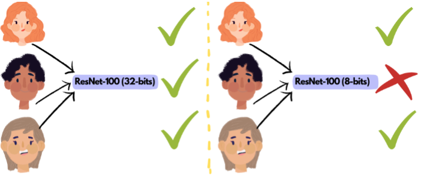
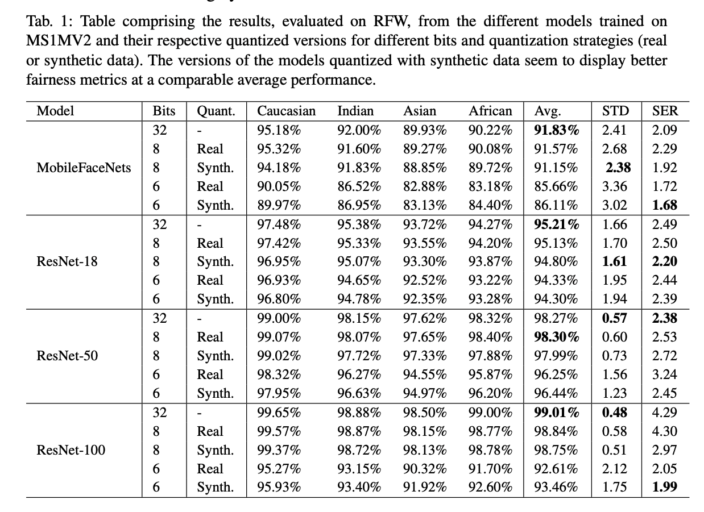
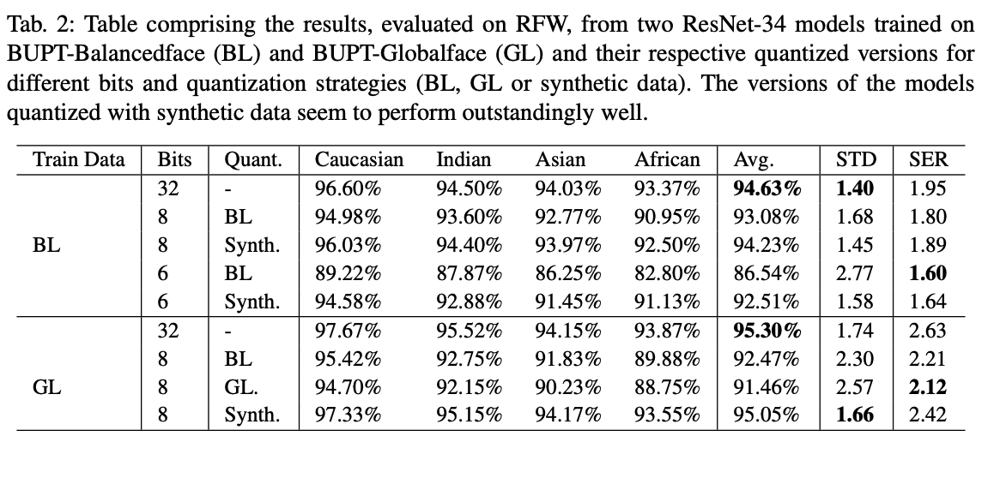

# Quantization and Racial Biases

Official repository for the "Compressed Models Decompress Race Biases: What Quantized Models Forget for Fair Face Recognition" paper at [BIOSIG 2023]([http://eusipco2023.org/](https://biosig.de)).

The paper can be viewed at: [Arxiv](https://arxiv.org/abs/2308.11840) and [IEEE Xplore](https://ieeexplore.ieee.org/abstract/document/10346003)

 

## Abstract

With the ever-growing complexity of deep learning models for face recognition, it becomes hard to deploy these systems in real life. Researchers have two options: 1) use smaller models; 2) compress their current models. Since the usage of smaller models might lead to concerning biases, compression gains relevance. However, compressing might be also responsible for an increase in the bias of the final model. We investigate the overall performance, the performance on each ethnicity subgroup and the racial bias of a State-of-the-Art quantization approach when used with synthetic and real data. This analysis provides a few more details on potential benefits of performing quantization with synthetic data, for instance, the reduction of biases on the majority of test scenarios. We tested five distinct architectures and three different training datasets. The models were evaluated on a fourth dataset which was collected to infer and compare the performance of face recognition models on different ethnicity.

## Datasets

This study utilized five distinct datasets. MS1MV2, BUPT-Balancedface and BUPT-Globalface have been used for training the base models and quantization, while the [synthetic data](https://github.com/fdbtrs/QuantFace) was only used for quantization and RFW just for evaluation of the models. 

### MS1MV2

MS1MV2 is widely used in the literature to train and compare several deep face recognition models. It is a refined version of the MS-Celeb-1M dataset, which further improved the training of these systems. The dataset contains 85k different identities and almost six million images and it is not balanced with respect to the race. 

### BUPT-Balancedface and BUPT-Globalface

Wang~\textit{et al.} introduced two distinct datasets to train deep face recognition systems. These datasets have been created to mitigate race bias on face recognition through skin tone labelling as African, Asian, Caucasian and Indian. BUPT-Globalface contains two million images from 38k different identities, and the distribution of races follows their distribution in the world. On the other hand, BUPT-Balancedface contains 1.3 million images from 28k identities which are divided into 7k identities per race. As such, this second dataset is race balanced. 

### Synthetic data

This dataset, introduced in contains approximately 500k unlabelled synthetic images. These images have been generated by a generative adversarial network. The noise used as input to generate the images was sampled from a Gaussian distribution and fed to a pretrained generator (official open source implementation of [StyleGAN2-AD](https://github.com/NVlabs/stylegan2-ada)). The usage of synthetic data is often seen to result in sub-optimal performances  which might be caused by a domain gap between real and synthetic data. In this work, the goal is not to use the synthetic data to learn the representations from scratch, and we further argue that there might exist advantages of this domain gap. 

### RFW

Racial Faces in-the-wild (RFW), was proposed by the same authors of BUPT-Balancedface, and was designed as a benchmarking dataset for fair face verification. Similarly, it includes labels for ethnicity, which allows for a fair assessment of potential biases. It contains 3000 individuals with 6000 image pairs for face verification.

## Results

 

 

## Citation 

@inproceedings{neto2023compressed,
  title={Compressed models decompress race biases: What quantized models forget for fair face recognition},
  author={Neto, Pedro C and Caldeira, Eduarda and Cardoso, Jaime S and Sequeira, Ana F},
  booktitle={2023 International Conference of the Biometrics Special Interest Group (BIOSIG)},
  pages={1--5},
  year={2023},
  organization={IEEE}
}

